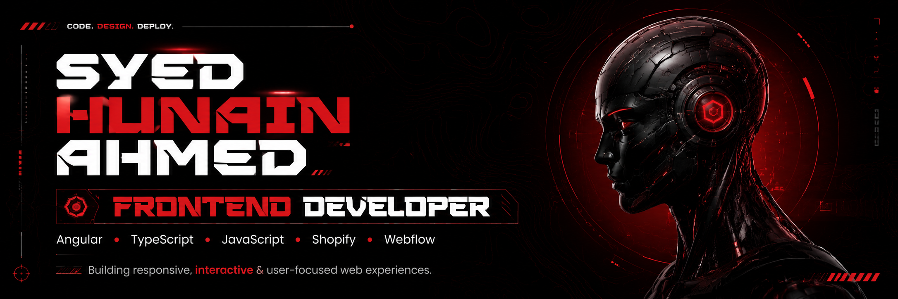

<!-- =========================================================
     SYED HUNAIN AHMED
     FRONTEND DEVELOPER
     GitHub Profile README
========================================================= -->

  

 

  
  &nbsp;
  
  &nbsp;
  

 

  <strong>Frontend Developer building responsive, interactive and user-focused web experiences.</strong>

  Angular · TypeScript · JavaScript · Shopify · Webflow · GSAP

 

---

## About Me

Frontend Developer with **2+ years of experience** building responsive web interfaces, business dashboards, e-commerce storefronts and CMS-based websites.

I specialize in translating UI designs into clean, maintainable and responsive frontend solutions using **Angular, TypeScript and JavaScript**, while also working with **Shopify, Webflow, REST APIs and GSAP**.

My development approach focuses on responsive implementation, reusable UI components, performance, usability and cross-device compatibility.

 

### What I Do

- Build responsive frontend applications with Angular and TypeScript
- Develop reusable UI components and interactive interfaces
- Implement responsive layouts using HTML5, CSS3 and SCSS
- Build and customize Shopify storefronts and themes
- Develop responsive Webflow websites
- Integrate REST APIs with frontend applications
- Build admin and business dashboards
- Implement GSAP animations and frontend interactions
- Manage projects using Git and GitHub

 

---

## Professional Experience

### Frontend Developer · Peachy Digitals

**2+ Years of Experience**

I work across frontend applications, e-commerce storefronts, CMS websites, dashboards and interactive web experiences.

#### Frontend Development

- Develop responsive interfaces using Angular
- Build application functionality with TypeScript and JavaScript
- Create reusable and maintainable frontend components
- Implement responsive HTML, CSS and SCSS layouts
- Maintain compatibility across desktop, tablet and mobile devices

#### Shopify & Webflow

- Build and customize Shopify storefronts
- Customize Shopify themes and frontend components
- Develop responsive Webflow websites
- Maintain visual consistency across screen sizes
- Implement user-focused e-commerce interfaces

#### Applications & APIs

- Integrate REST APIs with frontend applications
- Connect interfaces with dynamic backend data
- Build admin and business dashboards
- Develop reusable dashboard components
- Implement frontend data binding

#### UI & Interaction

- Build GSAP-powered animations
- Develop interactive web interfaces
- Maintain smooth animation performance
- Translate visual designs into functional frontend experiences

 

---

## Selected Work

### Interfaces Built for Performance

My work includes responsive websites, e-commerce storefronts, business dashboards, API-driven applications and interactive frontend experiences.

**Frontend Interfaces**  
Angular, TypeScript and JavaScript based interfaces focused on usability, responsiveness and maintainable frontend architecture.

**E-Commerce Experiences**  
Shopify storefronts, theme customization and responsive shopping experiences.

**Business Applications**  
Admin dashboards, business interfaces, REST API integrations and dynamic frontend applications.

**Interactive Experiences**  
GSAP animations and UI interactions designed to improve the experience without compromising performance.

 

  

 

---

## Tech Stack & Skills

### Frontend Development

  
  &nbsp;&nbsp;&nbsp;
  
  &nbsp;&nbsp;&nbsp;
  
  &nbsp;&nbsp;&nbsp;
  
  &nbsp;&nbsp;&nbsp;
  
  &nbsp;&nbsp;&nbsp;
  

  Angular &nbsp;•&nbsp;
  TypeScript &nbsp;•&nbsp;
  JavaScript &nbsp;•&nbsp;
  HTML5 &nbsp;•&nbsp;
  CSS3 &nbsp;•&nbsp;
  SCSS

 

### CMS & E-Commerce

  
  &nbsp;&nbsp;&nbsp;&nbsp;&nbsp;
  

  Shopify &nbsp;•&nbsp; Shopify Theme Customization &nbsp;•&nbsp; Webflow

 

### UI & Animation

  

  GSAP &nbsp;•&nbsp; Responsive Design &nbsp;•&nbsp; Interactive UI Development

 

### Version Control

  
  &nbsp;&nbsp;&nbsp;&nbsp;&nbsp;
  

  Git &nbsp;•&nbsp; GitHub &nbsp;•&nbsp; GitHub Desktop &nbsp;•&nbsp; Version Control

 

### Applications & Integration

  REST API Integration &nbsp;•&nbsp;
  Dashboard Development &nbsp;•&nbsp;
  Data Binding

 

---

## GitHub Insights

  

 

  
  

  
  

 

---

## Core Focus

### Responsive Development

Interfaces designed to work consistently across desktop, tablet and mobile devices.

### Maintainable Frontend

Reusable components and clean frontend structures designed for easier long-term maintenance and scalability.

### Performance

Efficient frontend implementation and interactions with smooth performance and usability in mind.

### Interactive UI

Thoughtful animations and frontend interactions that enhance the user experience without overwhelming the interface.

### Design Implementation

Translating visual designs into accurate, functional and responsive frontend experiences.

 

---

## Let's Build Something Great

  I build clean, responsive and interactive frontend experiences that combine strong implementation with thoughtful user experience.

 

  
  &nbsp;
  
  &nbsp;
  

 

  <strong>CODE. DESIGN. DEPLOY.</strong>

  Syed Hunain Ahmed · Frontend Developer

