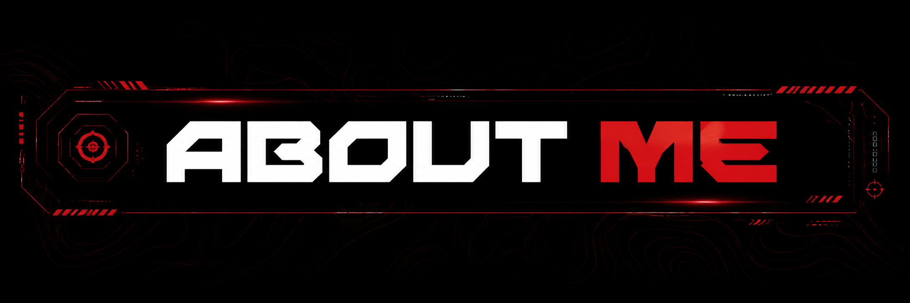
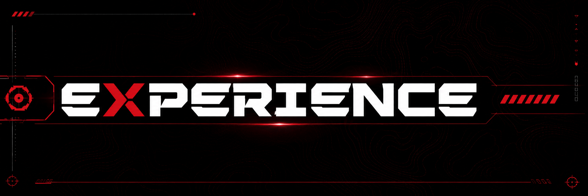
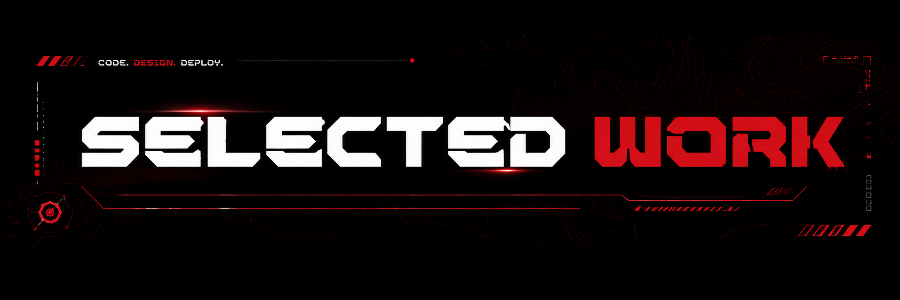
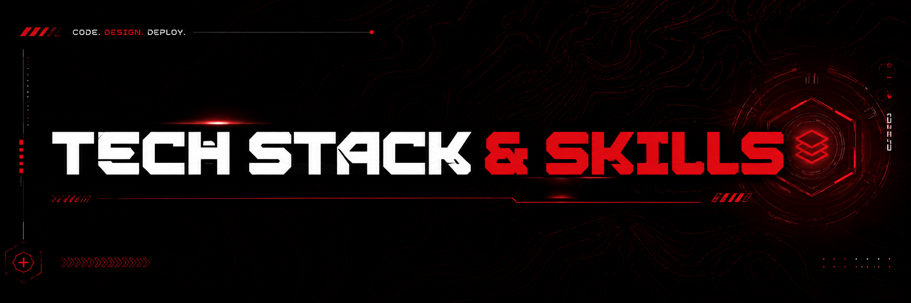
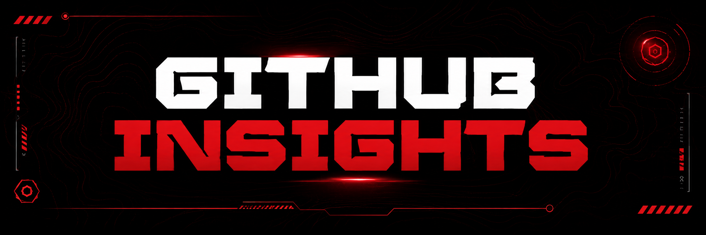
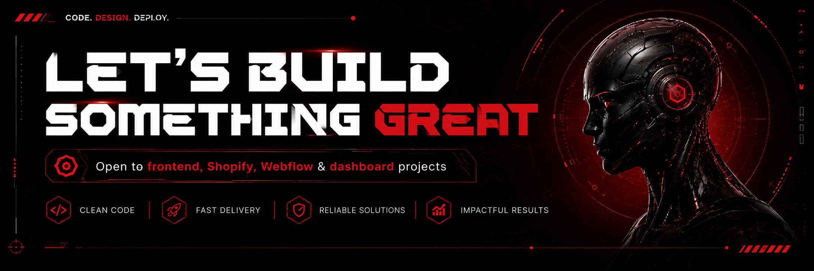

<!-- =========================================================
     SYED HUNAIN AHMED
     GitHub Profile README
     Frontend Developer
========================================================= -->

<!-- ========================= HERO ========================= -->

  

 

  
  &nbsp;&nbsp;
  
  &nbsp;&nbsp;
  

 

<!-- ======================= ABOUT ME ======================= -->

  

 

  <b>Frontend Developer</b> with 2+ years of experience building responsive,
  user-focused web interfaces, business dashboards, e-commerce storefronts
  and CMS-based websites.

  I focus on translating UI designs into clean, maintainable and responsive
  frontend solutions with strong attention to usability, performance and
  cross-device compatibility.

 

<table align="center">
  <tr>
    <td width="25%" align="center">
      <b>FRONTEND</b>
       
      Angular & TypeScript
    </td>

    <td width="25%" align="center">
      <b>INTERACTIVE UI</b>
       
      Responsive & GSAP
    </td>

    <td width="25%" align="center">
      <b>E-COMMERCE</b>
       
      Shopify Development
    </td>

    <td width="25%" align="center">
      <b>APPLICATIONS</b>
       
      APIs & Dashboards
    </td>
  </tr>
</table>

  

<!-- ====================== EXPERIENCE ====================== -->

  

 

<h2 align="center">Frontend Developer</h2>

<h4 align="center">Peachy Digitals · 2+ Years</h4>

 

<table>
  <tr>
    <td width="50%" valign="top">

### Frontend Development

- Develop responsive web interfaces using Angular
- Build frontend functionality with TypeScript and JavaScript
- Create reusable and maintainable UI components
- Implement responsive HTML, CSS and SCSS layouts
- Maintain cross-device compatibility

    </td>

    <td width="50%" valign="top">

### CMS & E-Commerce

- Build and customize Shopify storefronts
- Customize responsive Shopify themes
- Develop and maintain Webflow websites
- Create e-commerce interface components
- Maintain visual consistency across devices

    </td>
  </tr>

  <tr>
    <td width="50%" valign="top">

### Applications & APIs

- Integrate REST APIs with frontend applications
- Connect interfaces with dynamic backend data
- Build admin and business dashboards
- Implement reusable dashboard components
- Work with frontend data binding

    </td>

    <td width="50%" valign="top">

### UI & Workflow

- Build GSAP-powered animations and interactions
- Develop interactive user interfaces
- Focus on smooth frontend performance
- Manage code using Git and GitHub
- Use version control for project collaboration

    </td>
  </tr>
</table>

  

<!-- ===================== SELECTED WORK ==================== -->

  

 

<h2 align="center">Interfaces Built for Performance</h2>

  My work spans responsive frontend interfaces, business dashboards,
  Shopify experiences, Webflow websites and interactive web development.

 

<table align="center">
  <tr>
    <td width="33%" align="center" valign="top">

### Frontend Interfaces

Responsive and maintainable interfaces built with Angular,
TypeScript and JavaScript.

    </td>

    <td width="33%" align="center" valign="top">

### E-Commerce

Responsive Shopify storefronts and customized
e-commerce user experiences.

    </td>

    <td width="33%" align="center" valign="top">

### Business Applications

Admin dashboards, API-driven interfaces
and dynamic frontend applications.

    </td>
  </tr>
</table>

 

  

  

<!-- ====================== TECH STACK ====================== -->

  

 

<h3 align="center">Frontend</h3>

 

  
  &nbsp;&nbsp;&nbsp;
  
  &nbsp;&nbsp;&nbsp;
  
  &nbsp;&nbsp;&nbsp;
  
  &nbsp;&nbsp;&nbsp;
  
  &nbsp;&nbsp;&nbsp;
  

 

<h3 align="center">CMS & E-Commerce</h3>

 

  
  &nbsp;&nbsp;&nbsp;&nbsp;
  

 

<h3 align="center">UI & Animation</h3>

 

  

 

<h3 align="center">Version Control</h3>

 

  
  &nbsp;&nbsp;&nbsp;&nbsp;
  

 

  Angular &nbsp;•&nbsp;
  TypeScript &nbsp;•&nbsp;
  JavaScript &nbsp;•&nbsp;
  HTML5 &nbsp;•&nbsp;
  CSS3 &nbsp;•&nbsp;
  SCSS

  Shopify &nbsp;•&nbsp;
  Webflow &nbsp;•&nbsp;
  GSAP &nbsp;•&nbsp;
  REST API Integration &nbsp;•&nbsp;
  Dashboard Development

  

<!-- =================== GITHUB INSIGHTS =================== -->

  

 

<!--
  These SVG files are automatically generated by the
  GitHub Profile Summary Cards workflow.

  Do not manually edit these files.
-->

  

 

  
  

 

  
  

  

<!-- ====================== CORE FOCUS ====================== -->

<h2 align="center">CORE FOCUS</h2>

 

<table align="center">
  <tr>
    <td width="25%" align="center">
      <b>Responsive UI</b>
        
      Interfaces designed to work consistently across devices.
    </td>

    <td width="25%" align="center">
      <b>Maintainable Code</b>
        
      Reusable frontend structures built for long-term development.
    </td>

    <td width="25%" align="center">
      <b>Performance</b>
        
      Smooth and efficient interfaces with performance in mind.
    </td>

    <td width="25%" align="center">
      <b>User Experience</b>
        
      Clean and intuitive frontend experiences focused on usability.
    </td>
  </tr>
</table>

  

<!-- ====================== LET'S BUILD ====================== -->

  

  
  &nbsp;&nbsp;
  
  &nbsp;&nbsp;
  

 

  <b>CODE. DESIGN. DEPLOY.</b>

  Building responsive, interactive and user-focused web experiences.

 

  © 2026 Syed Hunain Ahmed

